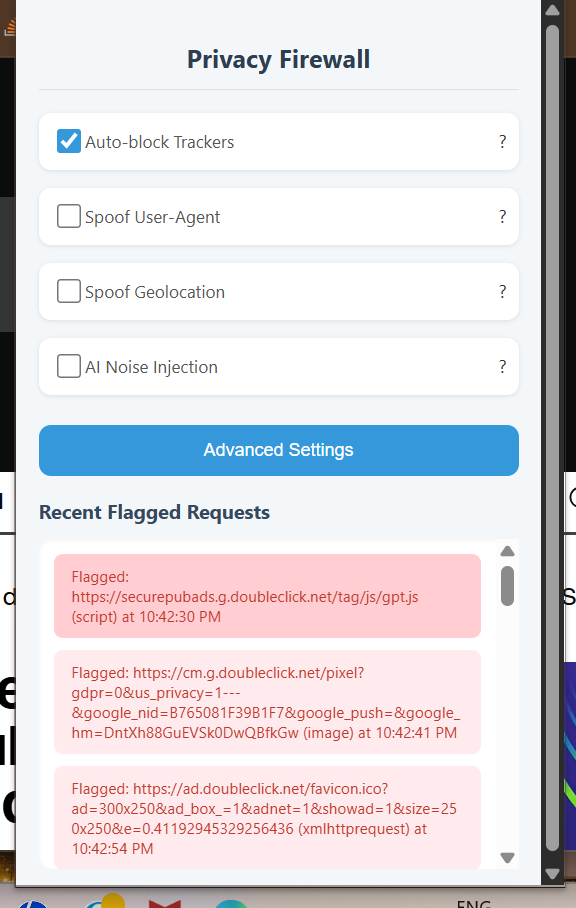
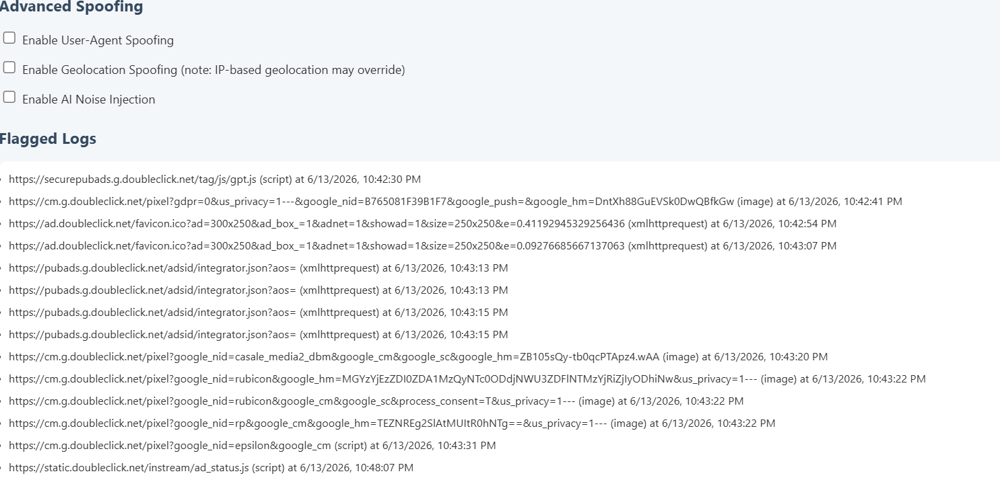

# Privacy Firewall for Humans (PFH)

## Screenshots

A lightweight, consumer-focused Chrome extension that acts as a **personal firewall for your data**.

Instead of blocking network ports, it blocks data leaks from websites, trackers, and AI apps.

## Features

- **Tracker Blocking** — Uses EasyList + custom rules to block known trackers (Google Analytics, DoubleClick, etc.)
- **User-Agent Spoofing** — Masks your browser fingerprint
- **Geolocation Spoofing** — Fakes location to the middle of the Atlantic Ocean
- **AI Noise Injection** — Adds random noise to inputs on ChatGPT and similar sites to prevent shadow data collection
- **Real-time Logging** — See exactly what was blocked
- **Clean, Intuitive UI** — With tooltips and advanced settings

## Installation

1. Download or clone this repository.
2. Open Chrome and go to `chrome://extensions/`
3. Enable **Developer mode** (top right)
4. Click **Load unpacked** and select the folder containing `manifest.json`
5. The extension icon should appear in your toolbar.

**Note**: For best results, grant it permission on all sites when prompted.

## How to Use

- Click the shield icon → toggle features
- "Auto-block Trackers" is enabled by default
- Check "Recent Flagged Requests" for activity
- Use "Advanced Settings" for logs and rule refresh

## Privacy & Security

- **No data collection** — Everything runs locally on your device
- **No telemetry**
- **Open source** — Audit the code yourself (MIT License)

## Limitations

- Cannot block native mobile/desktop apps (Chrome extension only)
- Geolocation spoofing works for JavaScript APIs but not IP-based location (use a VPN for full protection)
- Tracker blocking may require "Allow in incognito" for private browsing

## Contributing

Pull requests welcome! Especially for:
- More robust anti-fingerprinting
- Better EasyList parsing
- Frequency-based API monitoring

## Future Plans

- Firefox/Edge support
- Desktop companion app
- Submit to Chrome Web Store

---

**Made with ❤️ for privacy-conscious humans**
